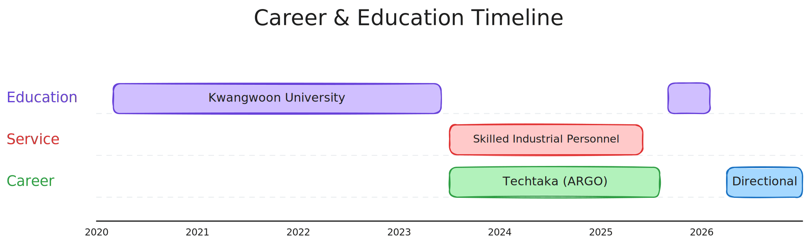

## Hyun-Jun Jo

Software Engineer with experience building warehouse logistics platforms at scale. Focused on event-driven architecture, distributed systems, and backend reliability.

---

### Tech Stack

**Backend**

**Infrastructure**

---

### Career & Work

<picture>
  <source media="(prefers-color-scheme: dark)"  srcset="assets/timeline.dark.svg">
  <source media="(prefers-color-scheme: light)" srcset="assets/timeline.light.svg">
  
</picture>

---

**[Directional](https://directional.net/)** -- Backend Engineer

**[Techtaka (ARGO)](https://www.argoport.com/)** -- Software Engineer, Warehouse Platform Team

### Education & Certifications

**Kwangwoon University** -- Software Department (2020.03 - 2026.02, GPA 4.15 / 4.5)

- Techtaka In-house Hackathon 1st Place
- DDD IT Union Club 9th Gen

---

### GitHub Stats

<picture>
  <source media="(prefers-color-scheme: dark)" srcset="https://github-readme-stats.vercel.app/api?username=Tianea2160&show_icons=true&count_private=true&hide_border=true&theme=dark" />
  <source media="(prefers-color-scheme: light)" srcset="https://github-readme-stats.vercel.app/api?username=Tianea2160&show_icons=true&count_private=true&hide_border=true&theme=default" />
  
</picture>
<picture>
  <source media="(prefers-color-scheme: dark)" srcset="https://github-readme-stats.vercel.app/api/top-langs/?username=Tianea2160&layout=compact&langs_count=6&hide_border=true&theme=dark" />
  <source media="(prefers-color-scheme: light)" srcset="https://github-readme-stats.vercel.app/api/top-langs/?username=Tianea2160&layout=compact&langs_count=6&hide_border=true&theme=default" />
  
</picture>
 
<picture>
  <source media="(prefers-color-scheme: dark)" srcset="https://streak-stats.demolab.com/?user=Tianea2160&theme=dark&hide_border=true" />
  <source media="(prefers-color-scheme: light)" srcset="https://streak-stats.demolab.com/?user=Tianea2160&hide_border=true" />
  
</picture>
